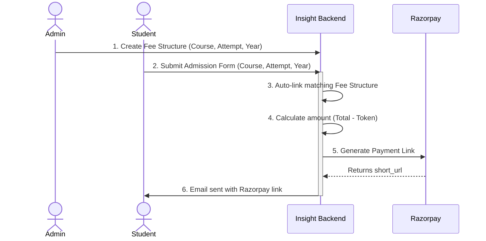

# Admission and Fee Structure Workflow

This document outlines the complete lifecycle from the administrator creating a fee structure, to a student submitting their admission form, and finally receiving a Razorpay payment link via email.

---

## 1. Creating the Fee Structure
The process begins with an administrator creating a **Fee Structure** in the backend. 

When creating a fee structure, the admin specifies:
- **Target Audience:** `course` (e.g., CSEET, CS Executive), `attempt` (e.g., June, December), and `year` (e.g., 2024).
- **Fee Breakdown:** ICSI Registration fees, ICSI Exam fees, Institute fees (Module 1/2/Both), and a Token amount.
- **Total Amount:** Automatically calculated as the sum of all the components.

> [!NOTE]
> The `is_active` flag must be set to `True` for the fee structure to be successfully fetched by the admission form.

## 2. Filling out the Admission Form
When a student lands on the frontend and fills out the admission form, they provide their personal details, academic history, and crucially, they select:
1. **Course Level** (`course`)
2. **Attempt Month** (`batch_attempt`)
3. **Attempt Year** (`attempt_year`)

Once the student hits "Submit", a `POST` request is sent to the `/api/admissions/` endpoint.

## 3. Dynamic Fee Fetching
When the backend receives the form submission, the system automatically runs the `_assign_fee_structure` helper logic.

- It maps the student's chosen `course` (e.g., "cseet") to the correct `FeeStructure.level`.
- It queries the database for the active `FeeStructure` where `level`, `attempt`, and `year` strictly match the student's inputs.
- The matching fee structure is saved directly to the `Admission` record.

> [!IMPORTANT]
> If a student selects a combination of Course + Attempt + Year for which no active fee structure exists, the admission record will still be saved, but no fee structure will be attached, and the Razorpay link will fallback to the default base fees.

## 4. Razorpay Link Generation
After the fee structure is linked, the system computes the amount the student needs to pay.

Based on our current configuration, the amount requested via Razorpay is:
**`Amount to Pay = Fee Structure Total Amount - Token Amount`** *(currently hardcoded to subtract 10,000)*.

> [!IMPORTANT]
> The Razorpay payment link will **only be generated and sent** if the student selected **"Full Payment"** (`full_payment`) for their payment type on the admission form. If they select **"Finance"**, no payment link is created.

If the student is eligible for a link, the backend makes an API call to Razorpay via the `create_payment_link()` service.
- **Reference ID:** Uniquely generated as `ADM_{id}_{timestamp}`.
- **Customer Info:** Populated with the student's name, email, and phone number.

## 5. Email Notification
Once Razorpay returns a successful `short_url` payment link, the backend triggers an email notification to the student's registered email address.

The email includes:
- A welcoming message confirming their form submission.
- The **Secure Online Payment Link** (the Razorpay `short_url`).
- Alternative offline bank transfer details (the bank account dynamically assigned to them in a round-robin style to stay under daily limits).
- A portal link to upload their payment receipt if they choose the offline bank transfer route.

> [!TIP]
> Additionally, a WhatsApp notification containing the exact same payment link is sent out via your `send_whatsapp_with_fallback` integration.
